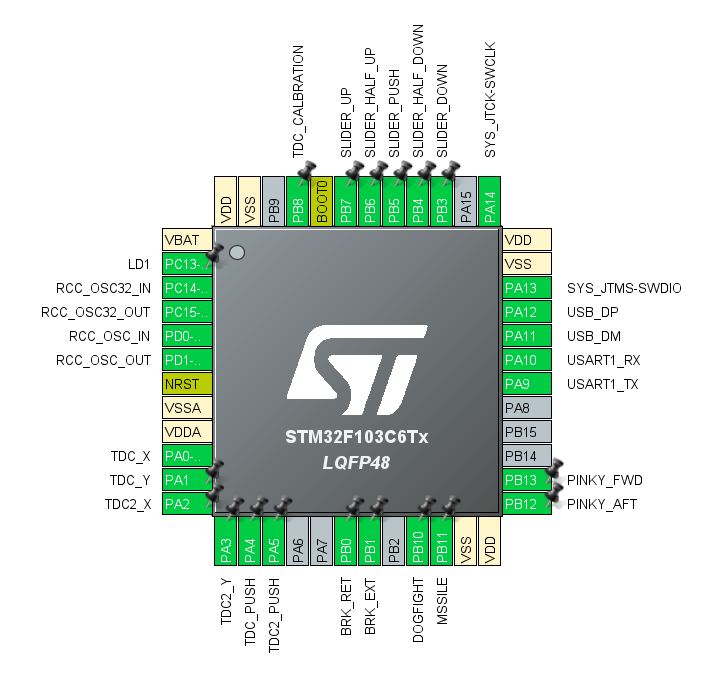

# Throttle Enhancer Bluepill STM32F103

## 概要
本プロジェクトは、STM32F103（Bluepill）を用いたスロットルエンハンサーのKiCad設計データです。

## 特徴
- STM32F103（Bluepill）を使用
- KiCad 9.0.3形式の設計ファイル
- ガーバーデータ同梱

HIDデバイスとして動作し、Saitek X-55 throttleにおける不便な機能・存在しない機能の追加を目的としています。

## ファイル構成
- `Throttle_Enhancer_Bluepill_STM32F103.kicad_pcb` : 基板レイアウト
- `Throttle_Enhancer_Bluepill_STM32F103.kicad_sch` : 回路図
- `Throttle_Enhancer_Bluepill_STM32F103.kicad_pro` : プロジェクトファイル
- `V1.zip` : ガーバーデータのZIPアーカイブ

## 使い方
1. KiCad 9.0.3以降でプロジェクトファイルを開く
2. 必要に応じて編集
3. `V1/`内のガーバーデータを基板製造業者に提出

## 必要なソフトウェア
- KiCad 9.0.3以降

## ライセンス
MIT

---

## STM32F103C6Tx ピン配置図

### 主なピンアサイン

| ピン名   | 機能                |
|----------|---------------------|
| PB9      | TDC_CALIBRATION     |
| PB8      | SLIDER_UP           |
| PB7      | SLIDER_HALF_UP      |
| PB6      | SLIDER_PUSH         |
| PB5      | SLIDER_HALF_DOWN    |
| PB4      | SLIDER_DOWN         |
| PA15     | SYS_JTDI            |
| PA14     | SYS_JTCK-SWCLK      |
| PA13     | SYS_JTMS-SWDIO      |
| PA12     | USB_DP              |
| PA11     | USB_DM              |
| PA10     | USART1_RX           |
| PA9      | USART1_TX           |
| PB15     | PINKY_AFT           |
| PB14     | PINKY_FWD           |
| PB13     | DOGFIGHT            |
| PB12     | MISSILE             |
| PA3      | TDC2_Y              |
| PA2      | TDC2_X              |
| PA1      | TDC_Y               |
| PA0      | TDC_X               |
| PA6      | TDC2_PUSH           |
| PA5      | TDC_PUSH            |
| PB1      | BRK_RET             |
| PB0      | BRK_EXT             |

※詳細は画像を参照してください。
